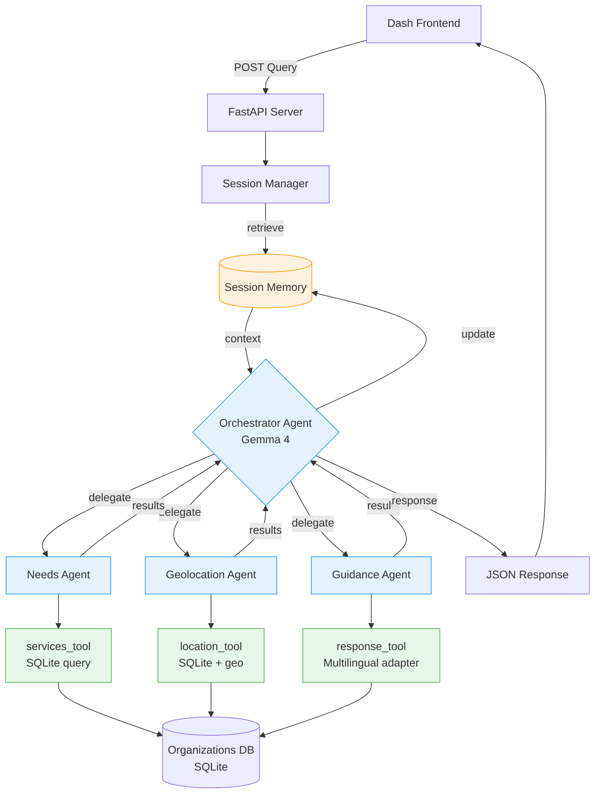

# RefugeeConnect AI 🌍

## 📋 Project Overview

An AI-powered assistant system designed to help refugees, asylum seekers, and migrants navigate the complex network of support organizations and social services available in Spain. The system combines an interactive dashboard with a multi-agent AI architecture to provide personalized guidance in multiple languages, breaking down the barriers of language, bureaucracy, and information fragmentation that affect the most vulnerable people.

> **Note:** This project was developed for the [Gemma 4 Good Hackathon](https://www.kaggle.com/competitions/gemma-4-good-hackathon) organized by Google DeepMind on Kaggle.


<!-- Replace with actual demo gif when available -->

---

## 🎯 The Problem

Every year, thousands of people arrive in Spain seeking asylum or better living conditions. They face a fragmented ecosystem of support organizations (Cruz Roja, Cáritas, ACNUR, CEAR, municipal social services, etc.) with no centralized information system. The challenges include:

- **Information fragmentation**: Each organization manages its own information, with no cross-coordination.
- **Geolocation dependency**: The quality of guidance received depends on which specific branch you visit, not on what services actually exist.
- **Language barriers**: Most resources are only available in Spanish, excluding a large part of the target population.
- **Volunteer dependency**: Many organizations rely on volunteers who, despite their goodwill, often lack the knowledge or tools to provide optimal guidance.

*This project was born from a real experience: the author arrived in Spain as a Cuban political asylum seeker, without family or financial support, and personally experienced all of the above.*

---

## 💡 The Solution

RefugeeConnect AI is a system with two complementary usage modes:

**1. Direct Query Dashboard**: An interactive map and filtering interface that allows direct consultation of the database of organizations, services, requirements, and locations — without AI, fast and accessible.

**2. AI Conversational Assistant**: A multi-agent system powered by Gemma 4 that understands the user's situation in natural language, identifies the most relevant resources, and provides personalized, step-by-step guidance in the user's own language.

---

## 🚀 Features

### Dashboard Features
- **Interactive map** with OpenStreetMap showing organization locations and routes
- **Multi-criteria filtering**: by city, service type, language, and requirements
- **Direct information** on services, requirements, schedules, and contact details
- **Multilingual interface**: Spanish, English, Arabic *(and more planned)*
- **Model selector**: switch between local inference (Ollama) and Google AI Studio API

### AI-Powered Features
- **Natural language understanding** of the user's situation
- **Automatic profile identification**: document status, needs, language, location
- **Intelligent routing** to the most appropriate organizations
- **Personalized guidance**: what to ask for, what documents to bring, what to expect
- **Response in the user's language**, regardless of the query language
- **Conversational memory** within the session

---

## 🏗️ Architecture

### Agent Architecture



### Data Flow

```
User (natural language, any language)
    ↓
Dash Frontend (interactive map + chat)
    ↓
FastAPI Backend (session management)
    ↓
Orchestrator Agent (Gemma 4 via Ollama or Google AI Studio)
    ↓
Specialized Agents (needs / geolocation / guidance)
    ↓
SQLite Tools (organizations, services, locations)
    ↓
Personalized response + map update
```

### Model Inference (Configurable)

| Mode | Provider | Use case |
|------|----------|----------|
| **Local** | Ollama + Gemma 4 (E2B/E4B) | Privacy, offline, demo without internet |
| **API** | Google AI Studio (Gemma 4) | Higher capability, easier setup |

---

## 🛠️ Technology Stack

### Frontend & Visualization
- **Plotly Dash**: Interactive web dashboard
- **Dash Leaflet / Folium**: Interactive map with OpenStreetMap
- **Plotly Graph Objects**: Charts and visualizations
- **HTML/CSS**: Custom styling

### Backend & Data
- **Python 3.13**: Core language
- **FastAPI**: Asynchronous API between Dash and AI agents
- **SQLite**: Database of organizations, services, and locations
- **Pandas**: Data processing

### AI & Agents
- **Google ADK**: Agent Development Kit (orchestrator + specialized agents)
- **Gemma 4**: Base model (E2B/E4B via Ollama or API via Google AI Studio)
- **Custom Tools**: Python functions for SQLite queries (ADK-compatible)

### Infrastructure
- **Docker + Docker Compose**: Multi-container isolation
- **GitHub Actions**: CI/CD with automated tests
- **Hugging Face Spaces**: Public deployment

---

## 📁 Project Structure

```text
refugeeconnect-ai/
│
├── common/                         # Shared resources between containers
│   ├── data/
│   │   ├── schema.sql              # Database schema
│   │   └── refugeeconnect.db       # SQLite database
│   │   └── logs/                   # Logs folder
│   │   │    └── logs.log           # Logs
│   ├── utils/
│   │   ├── __init__.py            
│   │   ├── tools.py                # utilities
│   │   └── logger.py               # Logging configuration
│   └── __init__.py
│
├── api_app/                        # FastAPI Backend Container
│   ├── IA_api.py                   # FastAPI server entry point
│   ├── agents/
│   │   ├── agent_manager.py        # AI architecture configuration
│   │   ├── agent.py                # Agents setup configuration
│   │   ├── tracing_plugin.py       # AI Trace configuration
│   │   └── __init__.py
│   ├── config.py                   # Configuration (model, inference mode)
│   ├── requirements.txt
│   ├── Dockerfile.api
│   └── .env.example
│   └── .dockerignore
│   └── .__init__.py
│
├── dash_app/                       # Dash Frontend Container
│   ├── app.py                      # Dash application entry point
│   ├── TRANSLATION.json            # Languages configuration
│   ├── requirements.txt
│   └── Dockerfile.dash
│   └── .env.example
│   └── .dockerignore
│   └── .__init__.py
│
├── docker-compose.yml
├── README.md
├── LICENSE
└── .gitignore
└── .python-version
└── pyproject.toml
└── uv.lock
```

---

## ⚙️ Installation & Setup

### Prerequisites

- Python 3.13
- Docker and Docker Compose
- Google AI Studio API key (for API mode) OR Ollama installed (for local mode)
- Git

### Quick Start with Docker (Recommended)

```bash
# 1. Clone the repository
git clone https://github.com/YOUR_USERNAME/refugeeconnect-ai.git
cd refugeeconnect-ai

# 2. Configure environment variables
cp api_app/.env.example api_app/.env
# Edit .env and add your API key if using Google AI Studio mode
echo "GEMINI_API_KEY=your_google_ai_studio_key_here" >> api_app/.env
echo "INFERENCE_MODE=api"  # or "ollama" for local mode

# 3. Start all services
docker-compose up --build

# 4. Access the application
# Dashboard: http://localhost:8050
# API Docs:  http://localhost:8000/docs
```

### Local Mode with Ollama

```bash
# Install Ollama (https://ollama.ai)
ollama pull gemma4:2b   # or gemma4:4b depending on your hardware

# Set mode in .env
echo "INFERENCE_MODE=ollama" >> api_app/.env
echo "OLLAMA_BASE_URL=http://localhost:11434" >> api_app/.env

# Start services
docker-compose up --build
```

### Manual Setup (without Docker)

```bash
# Install API dependencies
cd api_app && pip install -r requirements.txt

# Install Dashboard dependencies
cd ../dash_app && pip install -r requirements.txt

# Initialize database
python common/db/init_db.py

# Run API (terminal 1)
python api_app/IA_api.py

# Run Dashboard (terminal 2)
python dash_app/app.py
```

---

## 🗄️ Database Schema

### Main Tables

| Table | Description |
|-------|-------------|
| `organizations` | Name, type, description, contact |
| `branches` | Physical locations with coordinates |
| `services` | Types of services (regularization, health, housing...) |
| `organization_services` | Relationship: which org offers which service + requirements |
| `languages_served` | Languages attended per organization |

---

## 🤖 Agent Usage Examples

```
User: "I just arrived from Morocco, I don't have papers and I don't speak much Spanish.
       I'm in Madrid and I need food and a place to sleep tonight."

System: Identifies → emergency profile, Madrid, Arabic language, urgent needs (food + shelter)
Routes → Geolocation Agent (Madrid) + Needs Agent (food + emergency shelter)
Responds (in Arabic) → List of 3 organizations with address, hours, what to say when arriving
Updates → Map with nearest locations and routes
```

```
User: "Where can I apply for asylum in Valencia?"

System: Identifies → legal need, regularization, Valencia
Routes → Needs Agent (asylum) + Geolocation Agent (Valencia)
Responds → OAR office, CEAR Valencia, required documents, estimated waiting time
```

---

## 📊 Coverage (Initial Version)

- **Cities**: Madrid, Barcelona, Valencia, Seville, Bilbao *(expandable)*
- **Organizations**: ~20 national and local organizations
- **Service categories**: Legal/regularization, health, emergency shelter, food, employment, education
- **Languages**: Spanish, English, Arabic, French *(base)*

---

## 🎯 Hackathon Track

This project is submitted to:
- **Main Track** (Impact & Vision)
- **Impact Track — Digital Equity & Inclusivity**
- **Special Technology Track — Ollama** *(if local mode is demonstrated)*

---

## 🔮 Future Roadmap

- Expand coverage to all of Spain
- Integration with official APIs (social services portals)
- Mobile app with offline mode (Gemma 4 E2B on device)
- Collaborative system for organizations to update their own information
- Automated alerts for changes in regulations or available services
- Volunteer training module using the same system

---

## 👤 Author

**[Your name]**
Cuban engineer, political asylum seeker in Spain. This project was born from personal experience with the fragmented system of support organizations, with the conviction that AI can significantly improve the experience of people in vulnerable situations.

- GitHub: [@YOUR_USERNAME](https://github.com/YOUR_USERNAME)
- Kaggle: [@YOUR_KAGGLE](https://www.kaggle.com/YOUR_KAGGLE)

---

## 📄 License

This project is licensed under the **GNU General Public License v3.0 (GPLv3)** — see the [LICENSE](LICENSE) file for details.

---

## 🙏 Acknowledgments

- Google DeepMind for the Gemma 4 model and the Gemma 4 Good Hackathon
- Google for the Agent Development Kit (ADK)
- Cruz Roja, Cáritas, CEAR, ACNUR and all organizations that work daily to help people in vulnerable situations
